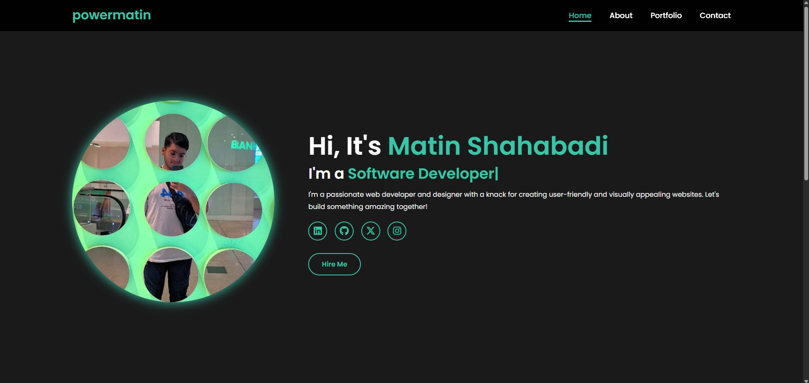

# Personal Portfolio Website



A modern, responsive, and visually appealing personal portfolio website for Matin Shahabadi, showcasing skills, projects, and contact information. This project is built with a focus on clean design, smooth animations, and a seamless user experience.

## Table of Contents
- [Features](#features)
- [Project Structure](#project-structure)
- [Technologies Used](#technologies-used)
- [Setup Instructions](#setup-instructions)
- [Deployment](#deployment)
- [Contributing](#contributing)
- [License](#license)
- [Contact](#contact)

## Features
- **Responsive Design**: Optimized for desktops, tablets, and mobile devices.
- **Dynamic Typing Animation**: Engaging text animation on the homepage to highlight roles.
- **Portfolio Showcase**: A grid-based portfolio section to display projects with images and descriptions.
- **Contact Form**: Backend-integrated contact form for sending messages via email.
- **Smooth Navigation**: Mobile-friendly navigation with a hamburger menu for smaller screens.
- **Social Media Integration**: Links to LinkedIn, GitHub, Twitter, and Instagram profiles.
- **SEO-Friendly**: Meta tags and semantic HTML for better search engine visibility.

## Project Structure
```
personal_website/
│
├── src/                        # Frontend source files
│   ├── assets/                 # Static assets
│   │   ├── images/             # Images (e.g., profile, project images)
│   │   ├── fonts/              # Custom fonts (if any)
│   │   └── css/                # CSS styles
│   │       ├── styles.css
│   │       └── responsive.css
│   ├── js/                     # JavaScript files
│   │   ├── main.js             # Navigation and UI interactions
│   │   └── form-handler.js     # Contact form handling
│   ├── pages/                  # HTML pages
│   │   ├── index.html          # Homepage
│   │   ├── about.html          # About page
│   │   ├── portfolio.html      # Portfolio page
│   │   └── contact.html        # Contact page
│   └── favicon.ico             # Favicon
│
├── backend/                    # Backend (Flask)
│   ├── app.py                  # Flask application
│   ├── templates/              # Email templates
│   │   └── email_template.html
│   ├── static/                 # Backend static files
│   ├── requirements.txt        # Python dependencies
│   └── .env                    # Environment variables
│
├── tests/                      # Unit tests
│   └── test_contact_form.py
│
├── docs/                       # Documentation
│   └── README.md
│
├── .gitignore                  # Git ignore file
├── package.json                # Frontend dependencies (if using npm)
├── LICENSE                     # License file
└── README.md                   # Project documentation
```

## Technologies Used
- **Frontend**:
  - HTML5, CSS3, JavaScript
  - Font Awesome (for icons)
  - Poppins Font (via Google Fonts)
- **Backend**:
  - Flask (Python)
  - SMTP (for email functionality)
- **Tools**:
  - Git & GitHub (version control)
  - npm (optional for frontend tooling)
  - VS Code (development environment)

## Setup Instructions

### Prerequisites
- **Node.js** (optional, for frontend tooling)
- **Python 3.8+** (for backend)
- **Git** (for cloning the repository)

### Frontend Setup
1. Clone the repository:
   ```bash
   git clone https://github.com/power0matin/personal_website.git
   cd personal_website
   ```
2. Navigate to the `src` directory and open `index.html` in a browser, or use a local server:
   ```bash
   npm install -g http-server
   http-server ./src
   ```
3. Access the website at `http://localhost:8080`.

### Backend Setup
1. Navigate to the `backend` directory:
   ```bash
   cd backend
   ```
2. Install Python dependencies:
   ```bash
   pip install -r requirements.txt
   ```
3. Create a `.env` file in the `backend` directory with your email credentials:
   ```
   EMAIL_USER=your_email@gmail.com
   EMAIL_PASS=your_app_password
   ```
   > Note: For Gmail, use an [App Password](https://support.google.com/accounts/answer/185833) if 2FA is enabled.
4. Run the Flask server:
   ```bash
   python app.py
   ```
5. The backend API will be available at `http://localhost:5000`.

### Testing
- Run unit tests for the contact form:
  ```bash
  cd tests
  python -m unittest test_contact_form.py
  ```

## Deployment
- **Frontend**:
  - Deploy static files (`src` directory) to platforms like **Netlify**, **Vercel**, or **GitHub Pages**.
  - Example for Netlify:
    1. Push the `src` folder to a GitHub repository.
    2. Connect the repository to Netlify and set the build directory to `src`.
- **Backend**:
  - Deploy the Flask app to platforms like **Heroku**, **Render**, or **AWS Elastic Beanstalk**.
  - Example for Heroku:
    ```bash
    heroku create
    git push heroku main
    heroku config:set EMAIL_USER=your_email EMAIL_PASS=your_app_password
    ```

## Contributing
Contributions are welcome! To contribute:
1. Fork the repository.
2. Create a new branch (`git checkout -b feature/your-feature`).
3. Commit your changes (`git commit -m "Add your feature"`).
4. Push to the branch (`git push origin feature/your-feature`).
5. Open a Pull Request.

Please ensure your code follows the project's coding standards and includes relevant tests.

## License
This project is licensed under the MIT License. See the [LICENSE](LICENSE) file for details.

## Contact
- **Matin Shahabadi**
- Email: matin_shahabadi@outlook.com
- GitHub: [power0matin](https://github.com/power0matin)
- LinkedIn: [Your LinkedIn](https://linkedin.com/in/your-profile)
- Instagram: [powermatin](https://www.instagram.com/powermatin)

---

⭐ If you find this project useful, please give it a star on GitHub! ⭐
