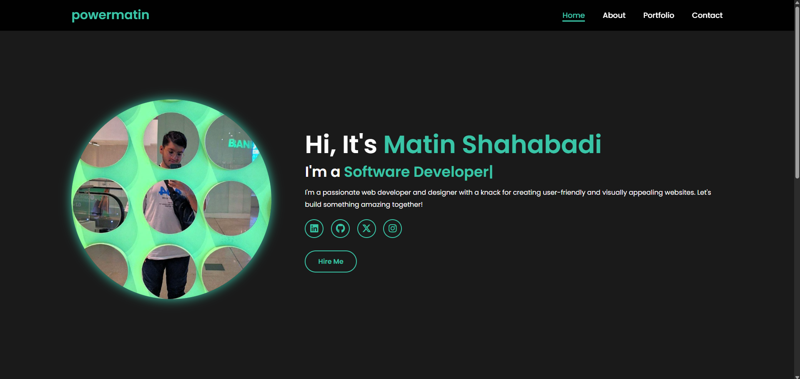

# 🌟 Personal Portfolio Website

<p align="center">
  
</p>

<p align="center">
  <a href="https://github.com/power0matin/personal_website"></a>
  <a href="https://developer.mozilla.org/en-US/docs/Web/HTML"></a>
  <a href="https://www.python.org/"></a>
  <a href="LICENSE"></a>
</p>

A modern, responsive, and visually appealing portfolio for **Matin Shahabadi**, showcasing skills, projects, and contact information. Built with clean design, smooth animations, and a seamless user experience.

 
## 📚 Table of Contents

* [Features](#-features)
* [Project Structure](#-project-structure)
* [Technologies Used](#-technologies-used)
* [Setup Instructions](#-setup-instructions)

  * [Prerequisites](#prerequisites)
  * [Frontend Setup](#frontend-setup)
  * [Backend Setup](#backend-setup)
  * [Testing](#testing)
* [Deployment](#-deployment)
* [Contributing](#-contributing)
* [License](#-license)
* [Contact](#-contact)

 
## ✨ Features

* **Responsive Design**: Optimized for desktop, tablet, and mobile.
* **Dynamic Typing Animation**: Engaging hero text to highlight roles.
* **Portfolio Showcase**: Grid-based gallery with images and descriptions.
* **Contact Form**: Backend-integrated form with email delivery.
* **Smooth Navigation**: Mobile-friendly navbar with hamburger menu.
* **Social Media Integration**: LinkedIn, GitHub, Twitter, and Instagram.
* **SEO-Friendly**: Semantic HTML + meta tags for better visibility.

 
## 🗂 Project Structure

```
personal_website/
│
├── src/                        # Frontend source
│   ├── assets/
│   │   ├── images/             # Profile & project images
│   │   ├── fonts/              # Custom fonts (optional)
│   │   └── css/
│   │       ├── styles.css
│   │       └── responsive.css
│   ├── js/
│   │   ├── main.js             # Navigation & UI interactions
│   │   └── form-handler.js     # Contact form handling
│   ├── pages/
│   │   ├── index.html          # Homepage
│   │   ├── about.html          # About
│   │   ├── portfolio.html      # Projects
│   │   └── contact.html        # Contact
│   └── favicon.ico
│
├── backend/                    # Flask backend
│   ├── app.py
│   ├── templates/
│   │   └── email_template.html
│   ├── static/
│   ├── requirements.txt
│   └── .env                    # Environment variables (local)
│
├── tests/
│   └── test_contact_form.py
│
├── docs/
│   └── README.md
│
├── .gitignore
├── package.json                # (optional) for frontend tooling
├── LICENSE
└── README.md
```

 
## 🛠 Technologies Used

**Frontend**

* HTML5, CSS3, JavaScript
* Google Fonts: *Poppins*
* Font Awesome (icons)

**Backend**

* Flask (Python)
* SMTP (email delivery)

**Tools**

* Git & GitHub (version control)
* npm (optional for local static server or tooling)
* VS Code (development)

 
## ⚙️ Setup Instructions

### Prerequisites

* **Node.js** (optional, for frontend tooling/local server)
* **Python 3.8+**
* **Git**

### Frontend Setup

```bash
git clone https://github.com/power0matin/personal_website.git
cd personal_website
```

Open `src/pages/index.html` directly in a browser **or** run a quick static server:

```bash
npm install -g http-server
http-server ./src
# Visit http://localhost:8080
```

### Backend Setup

```bash
cd backend
pip install -r requirements.txt
```

Create `.env` in `backend/`:

```
EMAIL_USER=your_email@gmail.com
EMAIL_PASS=your_app_password
```

> For Gmail, if 2FA is enabled, use an **App Password**.

Run the Flask server:

```bash
python app.py
# Backend API runs at http://localhost:5000
```

### Testing

```bash
cd tests
python -m unittest test_contact_form.py
```

> Ensure `.env` is configured before running integration tests.

 
## 🚀 Deployment

**Frontend (static `src/`)**

* Platforms: **Netlify**, **Vercel**, **GitHub Pages**
* Netlify example:

  1. Push the repo to GitHub.
  2. In Netlify, connect the repo.
  3. Set **Publish directory** to `src/`.

**Backend (Flask)**

* Platforms: **Render**, **Railway**, **Heroku**, **AWS Elastic Beanstalk**
* Heroku example:

  ```bash
  heroku create
  git push heroku main
  heroku config:set EMAIL_USER=your_email EMAIL_PASS=your_app_password
  ```

 
## 🤝 Contributing

Contributions are welcome!

1. Fork the repo
2. Create a feature branch: `git checkout -b feature/your-feature`
3. **Commit** your changes: `git commit -m "feat: add your feature"`
4. Push: `git push origin feature/your-feature`
5. Open a Pull Request

Please follow coding standards and include relevant tests.

 
## 📄 License

This project is licensed under the **MIT License**.
See [LICENSE](LICENSE) for details.

 
## 📬 Contact

**Matin Shahabadi (متین شاه‌آبادی / متین شاه آبادی)**

* Website: [matinshahabadi.ir](https://matinshahabadi.ir)
* Email: [me@matinshahabadi.ir](mailto:me@matinshahabadi.ir)
* GitHub: [power0matin](https://github.com/power0matin)
* LinkedIn: [matin-shahabadi](https://www.linkedin.com/in/matin-shahabadi)

 
⭐ If you find this project useful, please star the repo! ⭐


